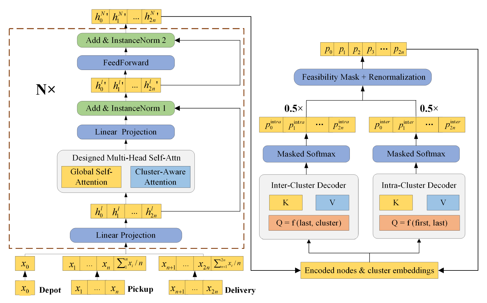

# CAADRL: Cluster-Aware Attention for Pickup and Delivery

Research code for **Cluster-Aware Attention-Based Deep Reinforcement Learning for Pickup and Delivery Problems**, by Wentao Wang, Lifeng Han, and Guangyu Zou (2026).

Wentao Wang and **Lifeng Han contributed equally** to this work. The accompanying manuscript describes Lifeng Han's contributions to figure preparation, baseline implementation, and ablation studies. This repository presents the collaborative research project as a numerical optimization and deep reinforcement learning coding example.

- [Paper on arXiv](https://arxiv.org/abs/2603.10053)
- [Accompanying manuscript PDF](Clupdtsp_main.pdf)
- [Original project repository](https://github.com/Botwwt/CluPDTSP)
- [Numerical pipeline reproduction guide](docs/reproducibility.md)

## What the code does

CAADRL constructs a short route for a static, single-vehicle Euclidean pickup and delivery problem. Each pickup must precede its paired delivery. The model combines global and cluster attention in its encoder, uses a gated dual decoder for intra-cluster and inter-cluster decisions, and trains with POMO-style policy gradients.

The numerical pipeline includes reproducible instance generation, training, checkpoint evaluation, configurable ablations, a heterogeneous-attention baseline, paired statistical analysis, route diagnostics, and runtime profiling. The problem studied here does not impose vehicle capacity or time-window constraints.

## Model architecture



Model architecture reproduced from Figure 2 of the [accompanying paper](Clupdtsp_main.pdf) (PDF page 10).

## Included artifacts

This source release includes code, the manuscript PDF, lightweight experiment summaries and figures, and available training configuration files. **Pretrained weights, pregenerated datasets, instance-level results, and runtime logs are not bundled.** The downloaded source contained Git LFS pointer files for these large artifacts; those pointers are omitted because they are not usable weights or data. Generate data and train a model using the commands below before evaluating it.

The retained summaries and figures document prior experiments. A small local verification of this release checks code syntax, deterministic data generation, and feasible CPU route construction; it does not reproduce the manuscript's full training or numerical benchmarks.

## Requirements and setup

- Python 3.9 or newer
- PyTorch 1.12 or newer
- NumPy, SciPy, Matplotlib, tqdm, pytz, and tensorboard_logger

From the repository directory:

```bash
python -m venv .venv
```

Activate the environment with `source .venv/bin/activate` on Linux/macOS or `.venv\Scripts\Activate.ps1` in PowerShell, then install the dependencies:

```bash
python -m pip install -r requirements.txt
python run_full.py --help
```

The main entry point uses CUDA when available and otherwise runs on CPU. Full training is intended for a GPU. Install a PyTorch build appropriate for your hardware if GPU execution is required.

## Quick start

Run a small training example with 10 customer nodes (five pickup-delivery pairs):

```bash
python run_full.py --task train --problem_size 10 --distribution clustered --epochs 1 --train_episodes 4 --train_batch_size 2 --result_dir result/smoke
```

The command saves `checkpoint-1.pt` under `result/smoke/_train_pdtsp_n10_clustered_full_gate/`. Generate three matching test instances:

```bash
python generate_pdp_dataset.py --name smoke --problem pdp --data_distribution clustered --cluster_std 0.1 --graph_sizes 10 --dataset_size 1 --num_files 3 --seed 10000 --data_dir data
```

Evaluate that checkpoint with greedy decoding:

```bash
python run_full.py --task test "data/pdp/pdp10_smoke_clustered_std0.1_seed*.pkl" --model_path result/smoke/_train_pdtsp_n10_clustered_full_gate --epoch 1 --decode_strategy greedy
```

This short example validates the pipeline; one training epoch does not produce the paper's reported solution quality.

## Data format

`problem_size` and `graph_sizes` count customer nodes, excluding the depot, and must be even. The first half of the customer nodes are pickups; the second half are their paired deliveries in the same order.

Evaluation accepts local `.pkl` files in either of these formats:

```python
[(depot_xy, node_xy), ...]
{'data': [(depot_xy, node_xy), ...], 'scale_factor': float}
```

`depot_xy` is an `(x, y)` coordinate and `node_xy` contains all customer coordinates. `experiment.py` evaluates one instance from each file, so use `--dataset_size 1` with `generate_pdp_dataset.py` for that entry point.

Generate 100 clustered, 100-node test instances:

```bash
python generate_pdp_dataset.py --name test --problem pdp --data_distribution clustered --cluster_std 0.1 --graph_sizes 100 --dataset_size 1 --num_files 100 --seed 10000 --data_dir data
```

The files are named `data/pdp/pdp100_test_clustered_std0.1_seed10000.pkl`, etc. Add `-f` to overwrite existing files.

For aggregate test sets consumed by the benchmark scripts, use:

```bash
python scripts/build_unified_test_sets.py --sizes 10 20 40 80 --distributions clustered uniform --num-instances 10000 --seed 10000 --cluster-std 0.1
```

This creates datasets under `data/pdp/unified/`, preserving instance order through `seed + instance_id`.

## Training and ablations

`experiment.py` is the shared training and evaluation entry point. The wrapper scripts select the following variants:

| Script | Variant |
| --- | --- |
| `run_full.py` | Full global and cluster encoder, gated dual decoder |
| `run_no_enc_cluster.py` | Global encoder without cluster attention |
| `run_cluster_only.py` | Cluster encoder without global attention |
| `run_no_dec_cluster.py` | Single decoder |
| `run_avg_fusion.py` | Fixed average decoder fusion |
| `run_no_pomo.py` | Full model with a single training rollout |
| `run_pomo.py` | Global attention baseline with cluster modules disabled |

Train the full model:

```bash
python run_full.py --task train --problem_size 100 --distribution clustered --train_batch_size 128 --epochs 800
```

Replace the script with any wrapper above to train an ablation. `--distribution uniform` selects uniform instances; `--disable_gate` selects rule-based fusion instead of the learned gate. `--seed`, `--train_episodes`, `--checkpoint-interval`, and `--result_dir` control reproducibility and outputs.

Resume from a compatible checkpoint:

```bash
python run_full.py --task train --problem_size 100 --distribution clustered --resume_path path/to/training_folder --resume_epoch 400 --epochs 800
```

Use the same ablation configuration for training, resuming, and evaluation. A checkpoint named `checkpoint-800.pt` is selected by `--model_path path/to/training_folder --epoch 800`.

## Evaluation and numerical analysis

After training a compatible checkpoint, evaluate the 100-node test files with greedy decoding:

```bash
python run_full.py --task test "data/pdp/pdp100_test_clustered_std0.1_seed*.pkl" --model_path path/to/training_folder --epoch 800 --decode_strategy greedy
```

For best-of-many sampling:

```bash
python run_full.py --task test "data/pdp/pdp100_test_clustered_std0.1_seed*.pkl" --model_path path/to/training_folder --epoch 800 --decode_strategy sampling --width 1280
```

The evaluator reports tour length and runtime per instance and summary statistics. Larger sampling widths require more memory.

The `scripts/` directory contains interfaces for batch evaluation, ablation grids, raw-result validation and aggregation, paired statistical comparisons, route metrics, route plotting, and profiling. Inspect each Python script's `--help` before supplying locally generated datasets, checkpoints, and results. Shell grid scripts use project-relative paths and require Bash; `scripts/run_ablation_grid.ps1` provides a PowerShell ablation entry point. The optional Heter baseline retains its own [usage instructions](baselines/heter/README.md).

## Project structure

| Path | Purpose |
| --- | --- |
| `experiment.py`, `run_*.py` | Shared entry point and ablation wrappers |
| `CVRPModel_training.py` | Attention model and decoder |
| `CVRPEnv.py` | Route state transitions and feasibility masking |
| `CVRProblemDef.py` | Instance loading, generation, and augmentation |
| `CVRPTrainer.py`, `CVRPTester.py` | Training and checkpoint evaluation |
| `generate_pdp_dataset.py` | Individual test-instance generation |
| `scripts/` | Evaluation, statistics, diagnostics, and benchmark pipelines |
| `baselines/heter/` | Third-party heterogeneous-attention baseline |
| `results/summary/`, `figures/` | Available historical summaries and figures |
| `data/`, `checkpoints/`, `result/` | Local generated datasets, models, and training outputs |

The historical module names begin with `CVRP`; this project's environment implements the pickup and delivery routing formulation described above.

## Attribution and license

The project's existing [MIT license](LICENSE) is preserved. The vendored heterogeneous-attention baseline retains its [upstream license](baselines/heter/LICENSE), source notices, and references, including its acknowledgement of [Wouter Kool's Attention Model](https://github.com/wouterkool/attention-learn-to-route). Paper authorship and third-party attribution are retained independently of GitHub commit authorship.

## Citation

```bibtex
@misc{wang2026clusteraware,
  title={Cluster-Aware Attention-Based Deep Reinforcement Learning for Pickup and Delivery Problems},
  author={Wentao Wang and Lifeng Han and Guangyu Zou},
  year={2026},
  eprint={2603.10053},
  archivePrefix={arXiv},
  primaryClass={cs.LG},
  url={https://arxiv.org/abs/2603.10053}
}
```
